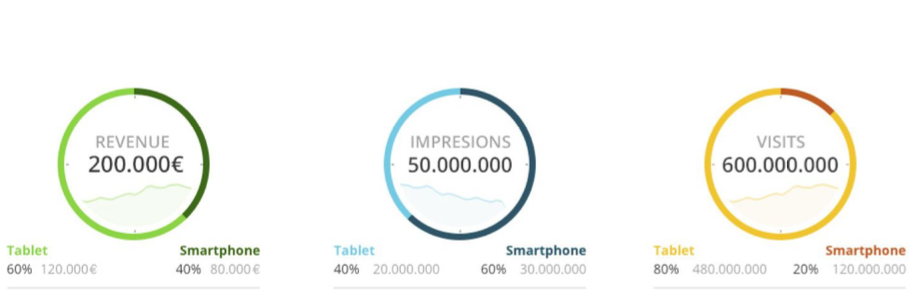

## Table of Contents

- [Description](#description)
- [Architecture](#architecture)
- [Setup](#setup)
- [Development mode](#development-mode)
- [Production mode](#production-mode)
- [Testing](#testing)

## Description
Create a client side web application in that reproduces the screenshot.
We will evaluate the client side code and the criteria will be based mainly on:
- Clean, maintainable, easy-to-read and unit tested code - WILL BE A MUST
- Good architectural practices
- Clean HTML and CSS markup
We will check by relevance:
- Produce a reusable component (View) connected to 3 different data models.
- Produce a reliable and unit tested code.
- There's a clear separation of concerns between different layers (presentation, data...) In order to
do that, you will need a dependency management tool.
- Pixel accuracy reproducing designs
- Good use of libraries
- Good use of pure Javascript language

Strong considerations:
- We encourage the usage of graphic library. Eg: D3JS library
- We recommend the usage of ES6.
- Don’t use external frameworks like jQuery, AngularJS or React JS
- Avoid any backend development / dependency. Create a mocked communication with a fake
server.
- Provide a README explaining how to set up the test.
Things to evaluate:
- Produce a reusable component (View) connected to 3 different data models.
- There's a clear separation of concerns between different layers (presentation, data...)
- Pixel accuracy reproducing designs
- Good use of libraries
- Good use of pure Javascript language



## Architecture

The project required a vanilla js implementation and in order to keep the code clean and scalable I implemented the flux architecture (one way data binding) to this project so there is a clear separation of concerns among:
 - `views`: holds the visual UI `charts`, `app` and `metrics`
 - `containers`: holds the data binding logic between `data` and `views`
 - `data`: holds the application's models state
 - `middleware`: holds the application logic
 - `store`: pure vanilla js implementation of the architecture logic
## Setup
- Required Node version: **>=10.17.0**
- Required Npm version: **>=6.11.3**
- Required Git version: **>=2.21.0**
- Clone the project and install the dependencies:
```sh
git clone git@github.com:joseaplwork/metric-charts.git
cd metric-charts && npm install
```

## Development mode
To start the development run:

```sh
npm start
```
Curious about the bundle? run the command and check the `dist` folder:

```sh
npm run build
```
## Production mode
To start the optimized production mode run:

```sh
npm run start:prod
```
and then open in the browser:
```
http://localhost:5000/
```
Curious about the bundle? run the command and check the `dist` folder:
```sh
npm run build:prod
```
## Testing
Run the unit tests with the following command:
```sh
npm test
```
or if you want make some changes in the test cases run:
```sh
npm run test:watch
```
